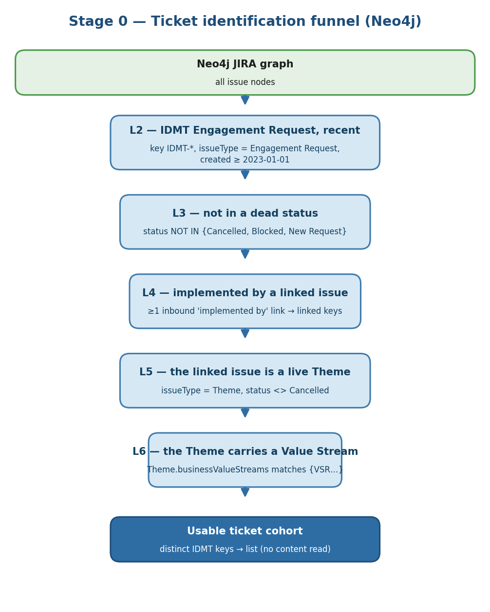
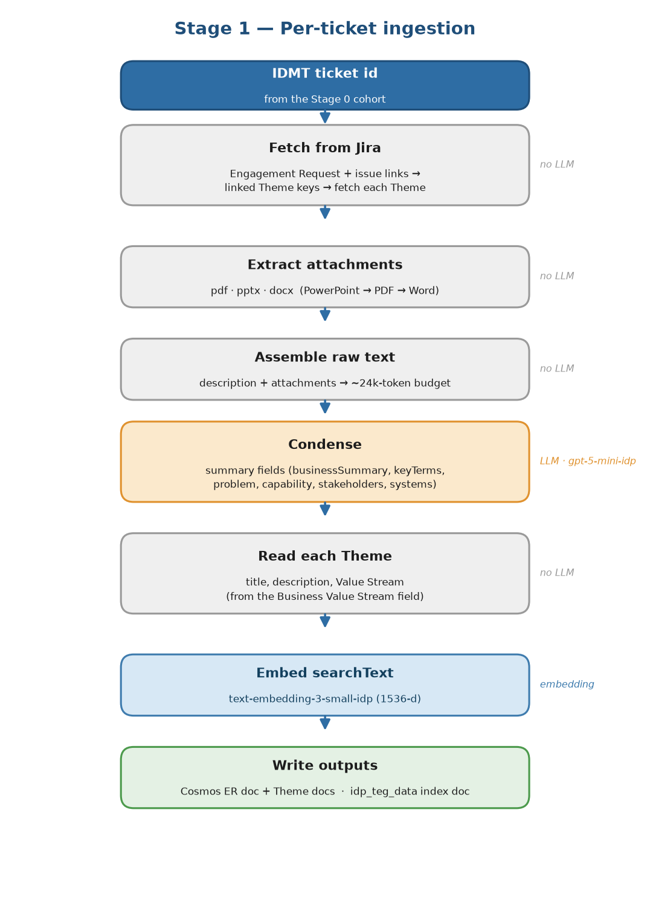
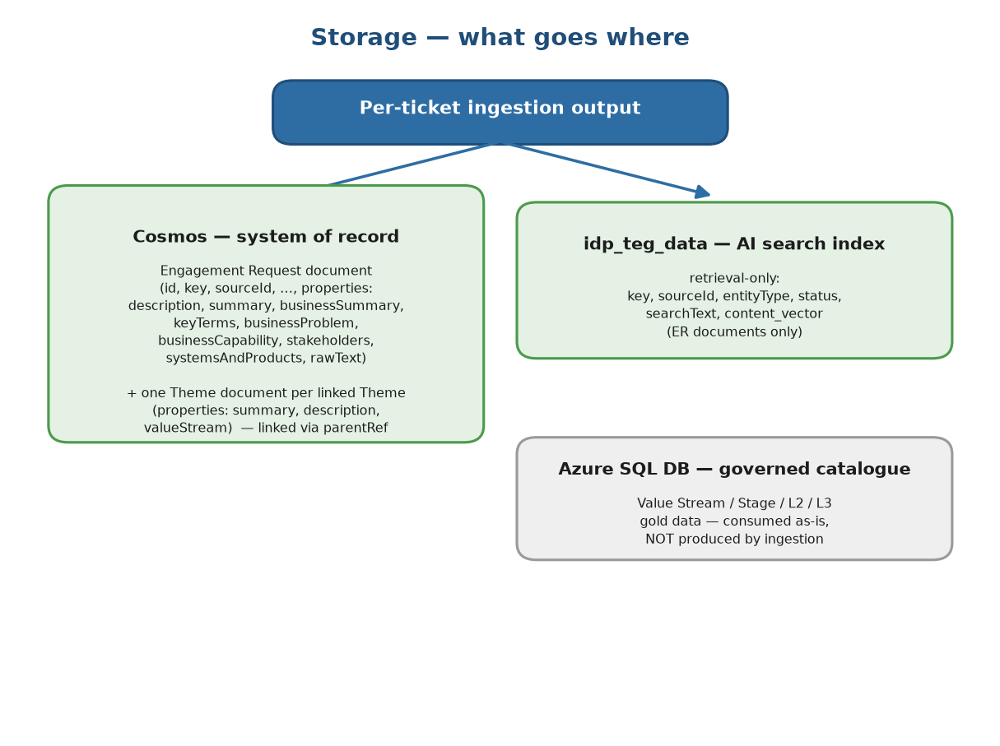

# Technical Design — Ingestion Module

**Theme & Epic Generation · Ingestion**

## 1. Purpose & scope

The ingestion module converts **historical IDMT Engagement Request tickets** into a trusted corpus that
the data-science (generation) module retrieves from. For every eligible ticket it produces:

1. a **condensed, durable record** of the ticket's content (system of record), and
2. each linked **Theme's** title, description, and **Value Stream** — the Business Architect's recorded
   Value Stream for that ticket, used as retrieval precedent.

Ingestion is **offline/batch** and contains no runtime generation logic. It writes to **Cosmos** (the
system of record) and **idp_teg_data** (the retrieval index). The governed Value Stream / Stage / L2 /
L3 catalogue is **not** produced here — it is the org's gold data in the **Azure SQL DB**, consumed
as-is.

## 2. Flow

```
STAGE 0 — Ticket identification (Neo4j 5-filter funnel)
  Neo4j JIRA graph  →  one Cypher query (L2→L6 funnel)  →  list of usable IDMT ticket keys

STAGE 1 — Per-ticket ingestion (run once per identified key)
  IDMT Engagement Request (Jira)
    → fetch ER + linked Themes
    → attachment extraction (no idea-card detection)
    → raw text assembly (description + attachments → ~24k-token budget)
    → Condense (LLM)              → business-context fields + rawText
    → Theme extraction            → title, description, Value Stream (from Jira)
    → write Cosmos (ER doc + Theme docs) + upsert idp_teg_data (searchText + content_vector)
```

## 3. Ticket identification (which tickets we ingest)

A **distinct first stage, upstream of the per-ticket pipeline.** We do **not** ingest every IDMT ticket
— we first identify the **usable Value-Stream cohort** and produce a list of their keys. The per-ticket
pipeline (Stage 1) then runs once per identified key.

Identification runs against the **Neo4j JIRA graph** (env: `NEO4J_URI / USER / PASSWORD / DATABASE`) as
a **single Cypher query** implementing a 5-filter funnel (L2→L6). A ticket survives to the cohort only
if **all** hold:

| filter | rule |
|---|---|
| **L2 — is an IDMT Engagement Request, recent** | `key` starts with `IDMT-`, `issueType = "Engagement Request"`, `creationDateEpoch ≥ since` (default **2023-01-01**) |
| **L3 — not in a dead status** | `status NOT IN {Cancelled, Blocked, New Request}` |
| **L4 — is implemented by a linked issue** | the IDMT has ≥1 **inbound "implemented by"** link — i.e. a Theme *implements* it. (From the IDMT's side this relationship is inward; the same link is outward "implements" on the Theme. We read it from the IDMT, so it appears inward.) |
| **L5 — the linked issue is a live Theme** | the linked key resolves to a JIRA node with `issueType = "Theme"` **and** its status is not `Cancelled` |
| **L6 — the Theme carries a Value Stream** | the Theme's `businessValueStreams` matches `…{VSR\d+}` (a valid Value Stream id is present) |

The query returns the **distinct ER keys** that pass all five; that key set is the cohort the batch
ingestion run consumes.

> **Status note.** The identification status exclusion is **{Cancelled, Blocked, New Request}** — the
> funnel rejects whole tickets that were dropped, on hold, or never started.

### How the funnel filters (single pass)

The funnel is one Cypher query — no per-ticket round trips — and each level narrows the previous set:

1. **Start from IDMT Engagement Requests (L2+L3).** Match graph nodes whose key begins `IDMT-`, whose
   issue type is *Engagement Request*, created on/after the cutoff, and whose status is not one of the
   dead states. This is the candidate pool.
2. **Pull each candidate's linked keys (L4).** From the IDMT node's inbound-link metadata, keep only the
   links of type *"implemented by"* and extract the linked issue keys. A candidate with no such link is
   dropped here — it has no implementing artifact, so no ground truth.
3. **Resolve the links to live Themes (L5).** Look up each linked key as a graph node and keep it only
   if its issue type is *Theme* **and** its status is not *Cancelled* — a dropped Theme is not a real
   label. (An "implemented by" link to a non-Theme issue does not qualify.)
4. **Require a Value Stream on the Theme (L6).** Keep the candidate only if at least one of its Themes
   has a `businessValueStreams` value matching `{VSR…}` — i.e. the Theme actually carries a Value
   Stream. A Theme with a blank or malformed Value Stream does not qualify the ticket.
5. **Return distinct, ordered IDMT keys.** A ticket that survives all four narrowings is emitted once,
   regardless of how many qualifying Themes it has.

The output is purely the **list of ticket keys** — no content is read in Stage 0. Reading content,
attachments, and the Theme details happens per-ticket in Stage 1.



## 4. Stage 1 — how a ticket is processed



For each key in the cohort, the per-ticket pipeline runs once. It takes **one ticket id** and assumes
Stage 0 already qualified it. The steps:

1. **Fetch from Jira.** Pull the Engagement Request (its fields + issue links). The links give the
   **linked Theme keys**; each Theme is then fetched with its Business Value Stream field. A linked
   issue that is not a real Theme (no Value Stream) is dropped, so only genuine Themes remain.
2. **Extract attachments** and **assemble the raw text** (§4.1, §4.2).
3. **Condense** the raw text into the business-context fields (§4.3).
4. **Read each Theme's** title, description, and Value Stream (§4.4).
5. **Write** the Cosmos Engagement-Request document, one Cosmos Theme document per linked Theme, and the
   AI-search index document (embedded) (§5).

The sub-steps below detail each part.

### 4.1 Attachment extraction

The business content comes from the ticket's **attachments**, fetched directly — there is **no
idea-card detection**; every supported attachment is extracted.

- **Supported formats & extraction libraries:**

  | format | library |
  |---|---|
  | `.pdf` | **pypdfium2** (PDFium via ctypes — fast, releases the GIL while parsing) |
  | `.pptx` | **python-pptx** |
  | `.docx` | **python-docx** |

- **Priority order: PowerPoint → PDF → Word.** Attachments are ordered by format priority
  (`.pptx` first, then `.pdf`, then `.docx`); within the same format, Jira's original order is kept.
  PowerPoint is highest because SMEs confirmed it is the most common idea-card format. This order is
  what the raw-text packing (§4.2) follows when the budget is tight.
- Legacy binary `.ppt` / `.doc` and image-only files would yield no text — but the EDA found **none** of
  these in the corpus, so all attachments in scope are text-extractable. No OCR.

### 4.2 Raw text assembly

The Jira **description** and the extracted attachment text are concatenated into a single **raw text**
blob, greedily packed into a **~24k-token budget**, attachments taken in the priority order from §4.1
(PowerPoint → PDF → Word). The description is part of that budget — there is no separate budget for it.
Highest-priority content is never displaced or truncated to fit a lower-priority attachment; the token
budget is the only cap.

### 4.3 Condense (LLM)

A single LLM pass extracts structured business context from the raw text, so downstream steps don't
re-process it. It produces the LLM-derived fields stored on the IDMT document (§4.4), and the raw text
is carried through as `rawText`.

- **Model:** `gpt-5-mini-idp` (the condense/summarization model).
- **Output** is a typed structured-output schema, not free-form JSON in the prompt.

### 4.4 Fields extracted

We extract content directly from Jira (and the LLM condense pass). We do **not** extract or store
Epics, Stages, L2/L3 capabilities, or Business Needs — only the Theme's title, description, and Value
Stream.

#### IDMT Engagement Request — from Jira

| field | source |
|---|---|
| `key` | Jira issue key (IDMT-####) |
| `sourceId` | stable Jira internal id |
| `description` | Jira description |
| `summary` | ticket title |
| `creationDate` | source creation date |
| `insightsTime` | source last-updated date |
| `status` | Jira status (stored on the index doc) |
| `rawText` | description + attachment text, packed to ~24k tokens (§4.2) |

#### IDMT Engagement Request — from Condense (LLM)

| field | source |
|---|---|
| `businessSummary` | LLM-generated business summary |
| `keyTerms` | domain terms & acronyms |
| `businessProblem` | business problem / pain point |
| `businessCapability` | desired capability / outcome |
| `stakeholders` | stakeholder groups |
| `systemsAndProducts` | referenced systems, platforms, products |

#### Theme — from Jira

| field | source |
|---|---|
| `key` | Jira issue key (GROUP-####) |
| `sourceId` | stable Jira internal id |
| `summary` | Theme title |
| `description` | Theme description |
| `valueStream` | the Theme's **Business Value Stream** field, formatted `"<name> {id}"`, taken **as-is** — no fuzzy matching, no LLM, no catalogue re-resolution |
| `creationDate` | Theme creation date |
| `insightsTime` | Theme last-updated date |

## 5. Storage schema



### 5.1 Cosmos — Engagement Request document

| field | description |
|---|---|
| `id` | document uuid |
| `key` | Jira issue key, e.g. `IDMT-####` (mutable business key) |
| `sourceId` | stable Jira internal id (e.g. 3364549); stable across IDMT-key changes |
| `source` | origin system — **`JIRA`** (uppercase) |
| `domain` | **`WORKITEM`** (uppercase) |
| `entityType` | **`ENGAGEMENTREQUEST`** (uppercase) |
| `createdAt` / `createdBy` | Cosmos creation date / actor (`createdBy` = **`TEG-INGESTION`**) |
| `lastModifiedAt` / `lastModifiedBy` | Cosmos modification date / actor (`lastModifiedBy` = **`TEG-INGESTION`**) |
| `parentRef` | the ER's own `sourceId` (an ER has no parent) |
| `properties` | nested object — extracted business context (below) |

**`properties`:** `description`, `summary`, `creationDate`, `insightsTime`, `businessSummary`,
`keyTerms`, `businessProblem`, `businessCapability`, `stakeholders`, `systemsAndProducts`, `rawText`.

### 5.2 Cosmos — Theme document

| field | description |
|---|---|
| `id` | document uuid |
| `key` | Jira issue key (GROUP-####) |
| `sourceId` | stable Jira internal id |
| `source` | origin system — **`JIRA`** (uppercase) |
| `domain` | **`WORKITEM`** (uppercase) |
| `entityType` | **`THEME`** (uppercase) |
| `createdAt` / `createdBy` | Cosmos creation date / actor (`createdBy` = **`TEG-INGESTION`**) |
| `lastModifiedAt` / `lastModifiedBy` | Cosmos modification date / actor (`lastModifiedBy` = **`TEG-INGESTION`**) |
| `parentRef` | the parent IDMT ticket's `sourceId` |
| `properties` | nested object (below) |

**`properties`:** `summary` (Theme title), `description`, `valueStream` (Value Stream linked to the
Theme), `creationDate`, `insightsTime`.

> Themes are **separate documents**, found via `parentRef` — not embedded as a `themes[]` array on the
> IDMT document.

### 5.3 AI Search index (idp_teg_data) — retrieval-only

Holds the historical Engagement-Request documents for retrieval.

| field | description |
|---|---|
| `key` | Jira issue key, e.g. `IDMT-####` (mutable business key) |
| `sourceId` | stable Jira internal id (stable across IDMT-key changes) |
| `entityType` | `ENGAGEMENTREQUEST` |
| `status` | Jira status (Cancelled / To Do / In Progress …) |
| `searchText` | `businessSummary + businessProblem + businessCapability + keyTerms + stakeholders + systemsAndProducts` |
| `content_vector` | vectorized `searchText` |

`content_vector` is produced by the **`text-embedding-3-small-idp`** embedding model (1536 dimensions).
The index returns ranked ids; the full ticket details are read from Cosmos at query time.

### 5.4 Azure SQL DB — governed catalogue (consumed, not produced)
The Value Stream / Stage / L2 / L3 catalogue is the org's **gold data in Azure SQL**, read as-is at
runtime. Ingestion does **not** define or store this catalogue.

## 6. Rules & conventions
- **Content is read directly from Jira** — the Theme's Value Stream is taken as-is from its Business
  Value Stream field; no fuzzy matching, no LLM, no catalogue re-resolution.
- **We store only the Theme's title, description, and Value Stream** — no Epics, Stages, L2/L3, or
  Business Needs are extracted or stored.
- **The index is retrieval-only** — `searchText` + `content_vector`; no labels or signals stored in it.
- **The Value Stream catalogue is Azure SQL gold data**, consumed as-is — not redefined or stored here.
- **Unit tests make no live Jira / Azure / LLM calls** — clients are injected (fakes).
